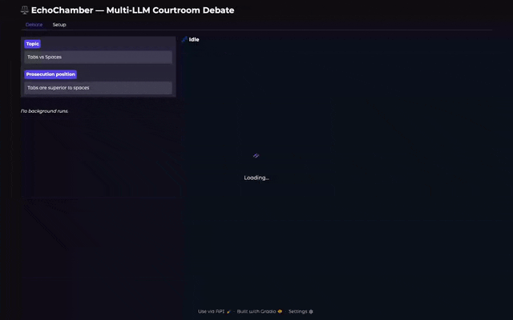

# EchoChamber ⚖️



**A multi-LLM courtroom debate environment.** Give it a topic and a position, and three LLM agents — Prosecution, Defense, and a Moderator/Judge — argue it out over structured rounds until a verdict is reached. Each agent can run on a different provider, so you can pit Claude against Llama with DeepSeek on the bench.

> This started as my first LLM project and is shared as a learning artifact. The architecture notes below include an honest retrospective of what changed as I learned.

## What it does

```
Moderator opens the session
└── Round 1..N
    ├── Prosecution argues (may call web_search)
    ├── Defense rebuts (may call web_search)
    └── Moderator evaluates → submit_evaluation(continue?, winner?)
Moderator searches, then rules → submit_verdict(winner, reasoning)
```

- **Mixed providers per role** — Anthropic, OpenAI, Together.AI, Google Gemini, or free local models via LM Studio.
- **Native tool calling with graceful degradation** — agents on tool-capable providers get a real `web_search` tool and the moderator returns structured verdicts through `submit_evaluation`/`submit_verdict` tools; providers without tool support (or local models that reject tools) automatically fall back to a `[SEARCH: query]` / `FINAL VERDICT:` text protocol.
- **Evidence folders** — drop `.txt/.md/.json/.csv/.pdf` files into a case folder with `shared/`, `prosecution/`, `defense/`, and `moderator/` subfolders; each agent only sees what its role is entitled to.
- **Context strategies** — evidence is injected whole (`full`), condensed (`summarize`), or retrieved on demand via ChromaDB embeddings (`rag`), auto-selected by size.
- **Cost metering and hard budgets** — every provider call is recorded (tokens, latency, cost from a data-driven pricing table); runs print a per-role cost summary, can export JSONL usage events, and `--max-total-tokens` halts a runaway debate gracefully mid-session.
- **Live GUI** — a Gradio app showing which agent/model is currently speaking, tokens burned against the budget, streaming turns, and the verdict.
- **Model recommendations (APA)** — surfaces top-2 model picks per role (with justification, price, and quality bar) from an APA procurement export, falling back to a bundled sample.
- **Debates as model evals** — a harness that scores a candidate model against an incumbent via side-balanced debates under a fixed judge, emitting a win-rate report and an APA-shaped finding.
- **Batch runner** — run a matrix of provider/model combinations on a thread pool from a YAML config, with cost estimates up front and actual costs in the report.
- **Transcripts** — every session is saved as markdown and optionally JSON. See [examples/](examples/) for sample outputs, including the all-important *pineapple on pizza* proceedings.

## Quickstart

Uses [uv](https://docs.astral.sh/uv/) (`pip install -e ".[all]"` in a venv works too):

```bash
git clone https://github.com/<you>/echochamber && cd echochamber
uv sync --extra all
cp .env.example .env   # add keys for the providers you'll use

# Free, fully local (requires LM Studio running on localhost:1234)
uv run echochamber \
  --topic "Tabs vs Spaces" \
  --position "Tabs are superior to spaces"

# Cloud providers
uv run echochamber \
  --topic "Should AI systems be open source?" \
  --position "AI systems should be open source for safety and transparency" \
  --prosecution-provider anthropic \
  --defense-provider together \
  --moderator-provider anthropic
```

The default provider is `lmstudio`, so everything works with zero API keys if you have [LM Studio](https://lmstudio.ai) serving a local model.

### Debating over evidence

```bash
# Scaffold a case folder
uv run echochamber --init-case ./cases/my_case --topic "My Topic"

# Run against the bundled example case
uv run echochamber \
  --topic "Python vs Rust for High-Performance Data Processing" \
  --position "Rust should be chosen for the new system" \
  --case-folder cases/example_case
```

Each role gets its own private evidence plus everything in `shared/`. A `moderator/` folder can hold evaluation criteria the judge alone sees. Large evidence sets are automatically summarized or chunked into a vector store (`--context-strategy full|summarize|rag`).

> **Note:** `cases/` is gitignored except for the bundled example — real case material stays out of version control by default.

### GUI

```bash
uv sync --extra ui
uv run python -m echochamber.ui     # http://localhost:7860
```

Configure providers/models per role (or one-click apply the APA picks), set a hard token budget, and watch the debate stream: a status banner shows which agent and model is speaking, a live ticker shows tokens burned against budget and running cost, and the verdict lands with a per-role cost breakdown. A Stop button aborts after the current turn.

Each role also takes **custom system-prompt additions**, and the **Case evidence** panel links a local case folder (`shared/` for everyone plus proprietary `prosecution/`, `defense/`, `moderator/` subfolders) with an inspect button showing exactly what each side will see.

No terminal needed for keys: the **Setup tab** lets you paste provider API keys, test each one against the live API, and save — keys land in a local `.env` readable only by your user account and take effect immediately. (Tip: create keys with low spend limits in each provider's console.)

Closing the tab mid-debate triggers the browser's leave warning; an on-page preference decides whether the debate then **aborts or continues in the background** (backgrounded runs stay listed with live token counts and still save transcripts).

### Model evals — debates as benchmarks

A debate win under a fixed judge is a capability signal. The eval harness pits a candidate model against an incumbent across N topics, each debated twice with sides swapped (so side bias cancels), same judge throughout:

```bash
uv run python -m echochamber.evals \
  --candidate-provider gemini --candidate gemini-2.5-pro \
  --incumbent-provider gemini --incumbent gemini-2.0-flash \
  --judge-provider gemini --judge gemini-2.5-pro \
  --topics 3 --rounds 1 --max-total-tokens 30000 \
  --apa-findings findings.jsonl
```

Outputs a JSON report (win/loss/draw per matchup, score, actual cost) and optionally appends an APA-shaped finding (`{kind, lab, model, headline, why, priceIn, priceOut}`) that a procurement agent can ingest — closing the loop: APA recommends models for debates, and debates feed evidence back to APA. Evals are noisy at small N; use 3+ topics and expect ~0.5 for equal models.

### APA model recommendations

If you run an APA (Agent Procurement Agent) deployment, point EchoChamber at it:

```bash
export ECHOCHAMBER_APA_DATA=~/path/to/apa/data   # dir with apa-roles.json + apa-state.json, or a merged export
```

The GUI (and `echochamber.recommendations`) then surfaces the top-2 models per debate role — judge maps to APA's "reasoning" role, advocates to "daily" — each with justification, current price, and the benchmark bar it cleared. Without APA data, a bundled sample keeps the feature demonstrable.

### Batch runs

```bash
uv run python -m echochamber.batch --config runs_example.yaml --parallel 3
```

Runs variations in-process on a thread pool, prints estimated cost per run before starting (with an approval gate above a threshold), and reports winner, rounds, and **actual** metered cost per run.

### Cost tracking

Every run ends with a usage summary (calls, tokens, dollars per role). Pass `--usage-log usage.jsonl` to append one normalized event per provider call:

```json
{"type": "usage", "at": "...", "host": "echochamber", "module": "debate.prosecution",
 "model": "gpt-4o", "input": 1204, "output": 512, "costUsd": 0.00813, "latencyMs": 2140, "note": "openai/gpt-4o"}
```

The event shape follows agent-stable's normalized usage-event schema (a companion cost/performance metering package), so the log can be ingested by its sinks/dashboard directly. Prices live in [echochamber/data/pricing.json](echochamber/data/pricing.json) — a data file, not code.

## Architecture

```
echochamber/
├── cli.py                  # Thin argparse layer over the runner
├── ui.py                   # Gradio GUI: live status, token/cost ticker, stop button
├── evals.py                # Debates-as-benchmarks harness → report + APA finding
├── recommendations.py      # APA export → top-2 model picks per debate role
├── batch.py                # Thread-pool multi-run orchestration + cost gates
├── core/
│   ├── runner.py           # DebateSpec + run_debate(): the one entry point
│   ├── session.py          # CourtSession: round loop, structured verdicts + text fallback
│   ├── turns.py            # Agent turn loop: native tool transport or sentinel fallback
│   ├── agent.py            # Agent = name + role + provider + prompt (+ meter)
│   ├── usage.py            # UsageMeter → cost summaries, JSONL events, hard token budget
│   ├── evidence.py         # Case folder loading (txt/md/json/csv/pdf)
│   ├── preprocessor.py     # full / summarize / RAG context strategies
│   ├── transcript.py       # Markdown + JSON transcript writing
│   └── costs.py            # Estimates, priced from data/pricing.json
├── data/pricing.json       # Per-model $/1M token table (edit freely)
├── providers/
│   ├── base.py             # Message / ToolDef / ToolCall / LLMResponse protocol
│   ├── retry.py            # Centralized exponential backoff
│   ├── openai_compat.py    # One implementation for OpenAI, Together, LM Studio
│   ├── anthropic.py        # Native tools via tool_use/tool_result blocks
│   └── gemini.py           # Text-only (sentinel fallback) on the legacy SDK
├── roles/prompts.py        # Prosecution / Defense / Moderator system prompts
└── tools/search.py         # DuckDuckGo search + web_search ToolDef + sentinel parsing
tests/                      # Fake-provider suite for the orchestration logic
```

Design choices worth noting:

- **Zero hard dependencies.** Every third-party library (provider SDKs, `pymupdf`, `chromadb`, `ddgs`, `yaml`, `dotenv`) is lazily imported, so the core installs clean and you only pull in what your chosen providers/features need.
- **Tools first, sentinels as fallback.** Control flow (searches, round evaluations, verdicts) uses native tool calling wherever the provider supports it, with the original text protocol kept as a per-call fallback — so a local model that rejects `tools` degrades mid-debate without crashing the session.
- **One OpenAI-compatible adapter.** OpenAI, Together.AI, and LM Studio share a single implementation; a new OpenAI-compatible provider is ~25 lines of client construction.
- **Threads, not asyncio.** Debate turns are inherently sequential; parallelism only exists *across* runs, and those are I/O-bound API calls — a thread pool gets the full benefit without forking the provider layer into sync/async variants.

### Retrospective

What this project taught me, now folded back in:

- ~~Sentinel parsing~~ → native tool use with structured verdicts (the original `[SEARCH:]` implementation never actually fed results back to advocates — the tool loop fixed a real bug, not just style).
- ~~Subprocess batch parallelism~~ → in-process thread pool sharing one metered runner.
- ~~No tests~~ → a fake-provider suite covering the session loop, tool transports, budgets, verdict parsing, metering, and config loading.
- ~~Hardcoded pricing in code~~ → `data/pricing.json`.
- ~~Per-callsite try/except~~ → centralized retry with backoff.

Still open: Gemini native tools (needs the `google-genai` SDK migration), streaming output, and a live pricing source instead of a static table.

## License

[MIT](LICENSE)
